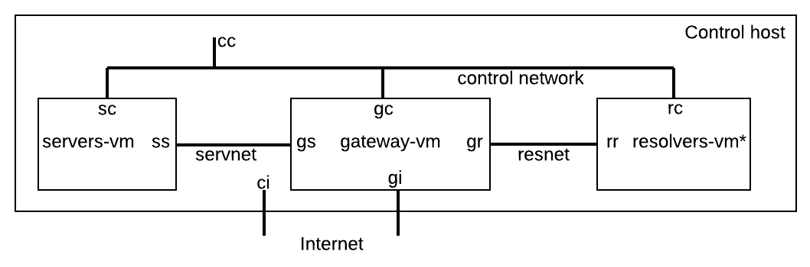

# Technical Plan for the Resolver Testbed

The testbed is designed to use VirtualBox for virtual machines (VMs) because it is free, cross-platform, and works
reasonably well for the current design (as far as we know now).

The overall design is to use multiple VMs and multiple networks to segregate traffic so that packet captures are cleaner.

The initial plan only covers IPv4. The requirements for IPv6 will include an IPv6 gateway on the control host or
on the network on which the control host resides; this might restrict some testing.

## Network Layout

The network names given here are the names used in VirtualBox.
Each interface on each VM has a two-letter mneumonic that indicates the VM and the network.

 * control network is host-only, **vboxnet0**, 192.168.56.x/24
 * resolvers network is internal, **resnet**, 172.20.x.x/24
 * servers network is internal, **servnet**, 172.21.x.x/16
 * Internet is bridged on the same external as the control host, with addresses from DHCP
 
## Control Host

The system that controls the testbed runs on any standard computer.
The control host has all of the configuration files, some of which are generated by Python scripts that are run before testing.
It pushes all the configurations to the VMs, and controls the testing by starting the recording and initiating the
tests over SSH.

The control host has two NICs:

 * **cc** on the control network (192.168.56.1)
 * **ci** on the Internet (via DHCP)

## VM Functionality and Network Connections

### Gateway VM

**gateway-vm** acts as an enhanced default router for the resolvers.
It has many functions:

 * Routing with interfaces for the resolvers, the simulated roots, and the Internet
 * Packet capture, logging, and display during tests
 * Delaying of packets bound for the simulated root servers
 
gateway-vm has four NICs:
 
 * **gc** on the control network (192.168.56.2)
 * **gr** on the resolvers network (172.20.1.1)
 * **gs** on the servers network (172.21.1.1)
 * **gi** on the Internet (via DHCP)
 
### Root Servers VM

**servers-vm** is all the simulated root servers on a single VM.
The tentative plan is to have 13 IPv4 and 13 IPv6 addresses on the VM
with one copy of BIND running as an authoritative server listening to
all 26 addresses.

In order to avoid issues with resolvers that might coalesce views of servers
on the same /24 network, the addresses for the root servers are each in their own
/24: 172.21.101.1, 172.21.102.1, 
and so on. The configuration for the network uses /16 for the netmask.

servers-vm has two NICs:

 * **sc** on the control network (192.168.56.3)
 * **ss** on the servers network (172.21.1.2)

### Resolver Systems

There can be multiple VMs that run the resolvers under test.
These include:

 * **resolvers-vm** contains numerous resolvers that are build
 from source under Debian.
 * Some tests will be for resolvers in their default configuration
 in Linux OS distributions, and will thus each need their own VM
 * Some tests will be for non-Linux VMs, particularly Windows Server
 * Resolvers running in hardware will possibly be supported

The resolvers-vm will allow building of many (but unfortunately not all) open source
resolvers.

Each resolver system has two NICs:

 * **rc** on the control network (192.168.56.4)
 * **rr** on the resolvers network (172.20.1.2)

